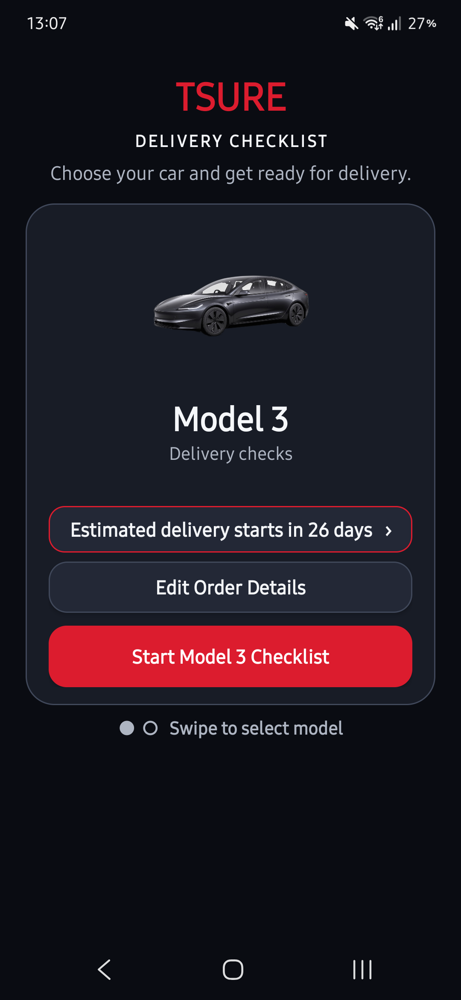
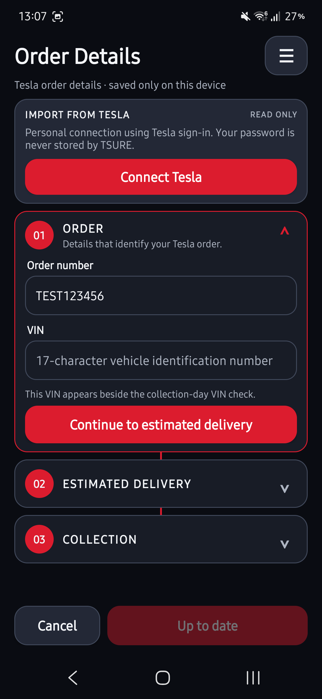
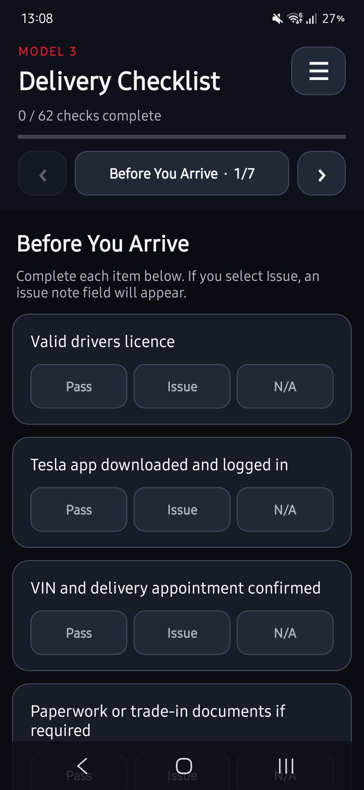
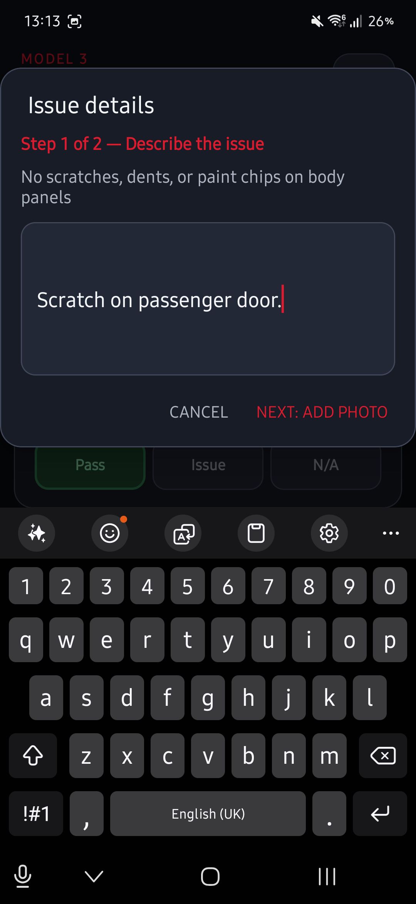
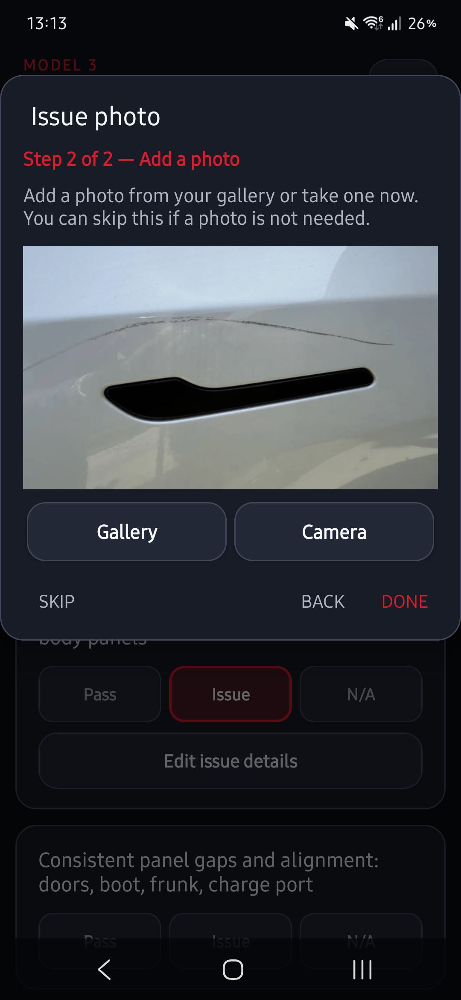
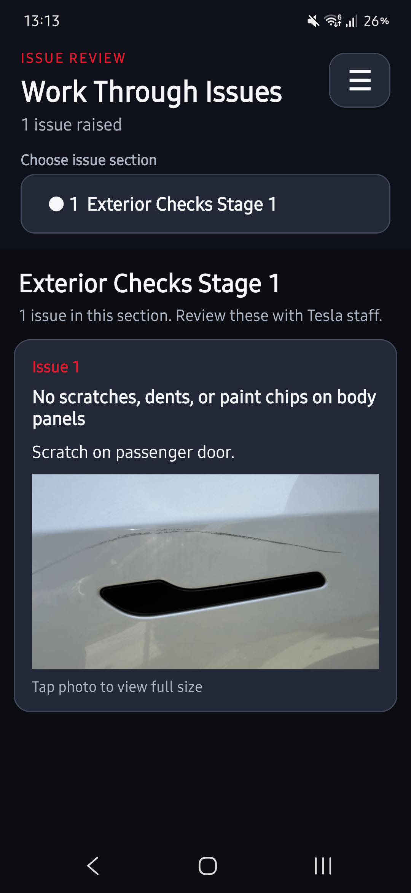

# TSURE

TSURE is a simple Android checklist for inspecting a Tesla on collection day.

Current version: **1.0.5**

<table>
  <tr>
    <td></td>
    <td></td>
    <td></td>
  </tr>
  <tr>
    <td></td>
    <td></td>
    <td></td>
  </tr>
</table>

## Features

- **Model 3 and Model Y checklists** — choose your vehicle and work through delivery-day checks covering the exterior, interior, technology, charging, documents, and final handover.
- **Saved progress** — checklist responses, notes, and photos are stored locally, with separate progress maintained for each supported model.
- **Optional Tesla account import** — connect through Tesla OAuth to import active order, VIN, estimated delivery, and collection details.
- **Private order summary** — the home screen shows a shortened VIN reference and a compact EDD range instead of exposing the full VIN.
- **Collection directions** — tap the saved collection centre name on the home screen to open directions in Google Maps.
- **Clear inspection status** — mark every check as Pass, Issue, or N/A and see overall and section-level progress as you work.
- **Section navigation** — quickly jump between checklist sections and see which sections are complete or contain issues.
- **Issue evidence** — describe a problem and attach a photo from the gallery or camera when an item is marked as an issue.
- **Focused issue review** — review reported issues by section in a dedicated view that is easy to work through with Tesla staff.
- **Flexible exports** — share the complete checklist as a text report, or export an issue-only report with attached photos through Android's share menu.
- **Custom checks** — add your own inspection items for accessories, options, or anything else you want to verify.
- **Private and offline** — no account or internet connection is required; checklist data remains on the device unless you choose to share it.

## Tesla account access

Connecting a Tesla account is optional. TSURE uses Tesla's OAuth authorization-code flow with PKCE and requests the `openid`, `email`, and `offline_access` scopes. The app uses this connection only to read active vehicle-order and delivery information; it does not send commands to the vehicle.

Your Tesla password is entered on Tesla's sign-in page and is never stored by TSURE. Access and refresh tokens are encrypted on the device using Android Keystore. Disconnecting the Tesla account removes those encrypted tokens while leaving any order details already imported into TSURE on the device.

This is a private, unofficial integration and is not affiliated with or endorsed by Tesla. Tesla may change or withdraw access to the underlying services without notice.

## Exporting reports

Open the hamburger menu from the checklist to share a full report containing every item and its status. From Issue Review, use its hamburger menu to export only reported issues, including descriptions and any supporting photos. Android's share menu lets you choose the available email, messaging, storage, or other compatible app.

## Installation

Download the latest APK from the [GitHub releases page](https://github.com/MGRayd/TesSure/releases) and install it on a device running Android 10 or later. Android may ask you to allow installation from your browser or file manager.

## Building locally

Build a debug APK from the repository root:

```powershell
.\gradlew.bat assembleDebug
```

The APK is written to `app/build/outputs/apk/debug/`.

A signed release build requires the project's private release keystore and a local, gitignored `keystore.properties` file. Once configured, build it with:

```powershell
.\gradlew.bat assembleRelease
```

The signed APK is written to `app/build/outputs/apk/release/`.
